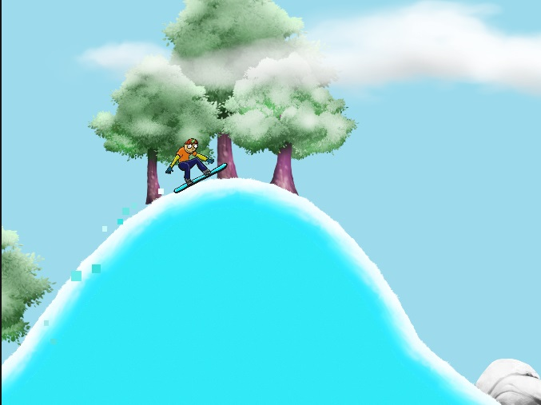

# SnowBoarder

<center>
</img>
</center>

**SnowBoarder** es un juego de estilo arcade en 2D desarrollado con Unity, enfocado en la mecánica de deslizamiento por pendientes y obstáculos.

## Características 📋

- Juego de desplazamiento lateral con gráficos en 2D.
- Controles simples e intuitivos.
- Mecánica de deslizamiento y salto sobre pendientes.

## Instalación y Uso 🛠️

1. Clona el repositorio en tu máquina local:

   ```bash
   git clone https://github.com/danielmaavre/SnowBoarder.git

2. Abre el proyecto en Unity (se recomienda usar la versión 2022.3 o superior).

    Ejecuta la escena principal para comenzar a jugar.

3. Uso 🕹️
- Movimiento: Usa las teclas de flechas para controlar el snowboarder.


## Contribuciones 🤝

Actualmente el juego cuenta con 1 nivel corto!

¡Las contribuciones son bienvenidas! Si deseas mejorar el juego o añadir nuevas características, por favor abre un issue o envía un pull request.